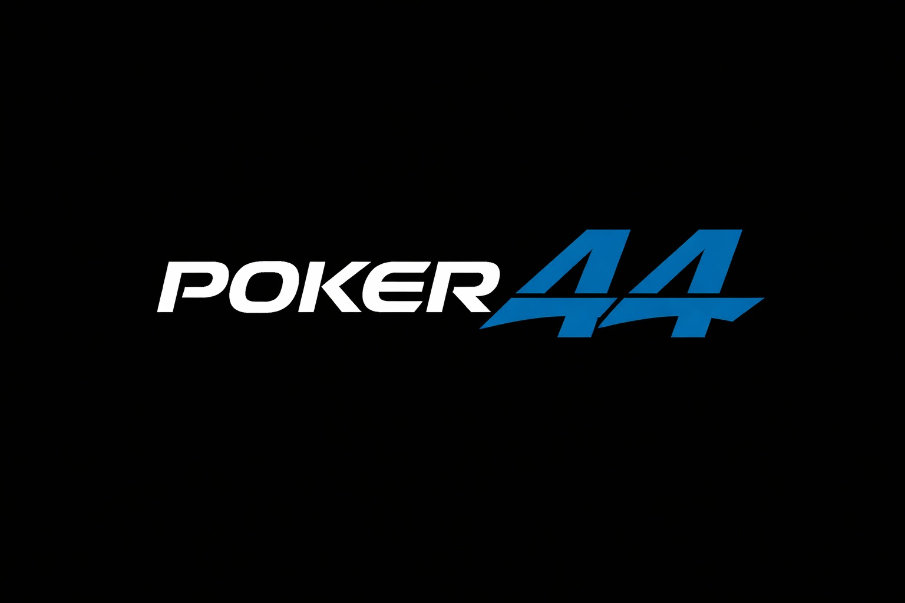
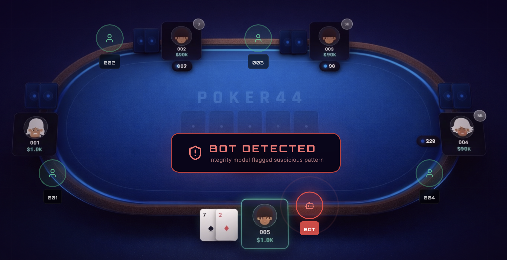

<div align="center">
  <h1>🂡 <strong>Poker44</strong> — Poker Bot Detection Subnet</h1>
  
  <p>
    <a href="docs/validator.md">🔐 Validator Guide</a> &bull;
    <a href="docs/miner.md">🛠️ Miner Guide</a> &bull;
    <a href="docs/anti-leakage.md">🛡️ Anti-Leakage</a> &bull;
    <a href="docs/roadmap.md">🗺️ Roadmap</a>
  </p>
</div>

---

## Official Links

- X: https://x.com/poker44subnet
- Web: https://poker44.net
- Whitepaper: https://poker44.net/Poker44_Whitepaper.pdf

---

## What is Poker44?

Poker44 is a Bittensor subnet focused on one problem: detecting bots in online poker with objective, reproducible evaluation.

Validators build labeled evaluation windows (human vs bot behavior), query miners, score predictions, and publish weights on-chain.  
Miners compete by returning robust bot-risk predictions that generalize to evolving bot behavior.

Poker44 is security infrastructure, not a poker room.

---

## Vision

### Short-Mid Term (Subnet Operating Model)

Poker44 currently uses a hybrid operating model to generate high-quality labeled datasets for miner evaluation.  
The immediate direction is to consolidate this into a decentralized runtime path where gameplay/integrity services are executed on validator infrastructure, with attested execution and reproducible evaluation loops.

### Mid-Long Term (Global Decentralized Platform)

Beyond the current hybrid stage, Poker44 targets a fully decentralized poker integrity platform:

- integrity and model-evaluation loop coordinated through the subnet,
- transparent, verifiable settlement through smart contracts,
- global trust-minimized operation with auditable behavior validation.

In short: today’s hybrid platform is the data/evaluation engine; the destination is a global decentralized platform with on-chain settlement guarantees.

---

## Target Outcome

The subnet is designed to support production anti-bot workflows where suspicious behavior is detected early and reviewed with evidence.

<div align="center">
  
</div>

---

## How the Subnet Works (V0)

### Validators

- Build mixed labeled chunks from private human hands plus generated bot hands.
- Query miners with standardized chunk payloads.
- Score miner outputs and set weights on-chain.

### Miners

- Receive chunked poker behavior payloads.
- Return `risk_scores` and predicted labels for each chunk.
- Publish a lightweight `model_manifest` describing the implementation behind the miner.
- Compete on accuracy, calibration, low false positives, and robustness over time.

---

## Data Model

### Public training data for miners

The repo includes a compressed human corpus:

`hands_generator/human_hands/poker_hands_combined.json.gz`

Intended use:

- Use it as human base data.
- Generate bot hands with `hands_generator/bot_hands/generate_poker_data.py`.
- Train your own model and features.
- Optionally build and publish a public benchmark artifact with:
  `python scripts/publish/publish_public_benchmark.py --skip-wandb`

### Validator evaluation data

Validators should not rely on the public corpus for evaluation.  
Set `POKER44_HUMAN_JSON_PATH` to a private local human dataset.

The public benchmark builder uses only the repo public human corpus plus offline-generated
bot chunks. It does not use validator-private human data and does not publish the live
validator evaluation dataset.

### Open-Source Miner Standard

Poker44 now supports a lightweight `model_manifest` attached to normal miner responses.
This does not change validator scoring or on-chain `set_weights`. It adds traceability for
miners that want to make their models open source while the subnet keeps the current
remote-inference evaluation loop.

Recommended manifest fields:

- public repo URL
- repo commit or tag for the production version
- model name and version
- framework
- license
- optional artifact URL / artifact SHA256

---

## Quick Start

```bash
git clone https://github.com/Poker44/Poker44-subnet
cd Poker44-subnet
python3 -m venv .venv
source .venv/bin/activate
pip install -e .
```

Then follow:

- [Validator setup](docs/validator.md)
- [Miner setup](docs/miner.md)
- [Public benchmark + W&B](docs/public-benchmark.md)

Validator operators can also enable optional auto-update support. See [Validator setup](docs/validator.md).

### Miner Launch Script ML Routing Threshold

`start_miner.sh` and `start_miner2.sh` support optional launch arguments for ML routing and single-hand model selection.

Usage:

```bash
./start_miner.sh "1,2,3" [ML_MAX_HANDS] [REMOVE_OTHER] [MODEL]
./start_miner2.sh "1,2,3" [ML_MAX_HANDS] [REMOVE_OTHER] [MODEL]
```

Argument behavior:

- `ML_MAX_HANDS` sets the upper bound for `2..N` short multihand chunks routed via single-hand ML vote
- default is `40` when argument is omitted
- `REMOVE_OTHER` (optional) toggles removing `other` actions (`0`/`1`, default `0`)
- `MODEL` (optional) accepts `4`, `4_17`, `5`, `5_17`
- when `MODEL` is omitted, default runtime artifacts are used:
  - `weights/ml_single_hand_model.pkl`
  - `weights/ml_single_hand_scaler.pkl`
- when `MODEL` is set, artifacts are selected as:
  - `4` -> `weights/ml_gen4_model.pkl` + `weights/ml_gen4_scaler.pkl`
  - `4_17` -> `weights/ml_gen4_17_model.pkl` + `weights/ml_gen4_17_scaler.pkl`
  - `5` -> `weights/ml_gen5_s123467_model.pkl` + `weights/ml_gen5_s123467_scaler.pkl`
  - `5_17` -> `weights/ml_gen5_17_s123467_model.pkl` + `weights/ml_gen5_17_s123467_scaler.pkl`

Examples:

```bash
./start_miner.sh "1,2,3" 40
./start_miner2.sh "1,2" 55
./start_miner.sh "7" 80 0 5
./start_miner.sh "1,2,3" 100 1 4_17
```

You can also set model selection directly via environment variables (used at miner startup before model preload):

- `POKER44_SINGLE_HAND_MODEL_ALIAS`
- `POKER44_SINGLE_HAND_MODEL_PATH`
- `POKER44_SINGLE_HAND_SCALER_PATH`

If none are set, miner uses the default active runtime paths:

- `weights/ml_single_hand_model.pkl`
- `weights/ml_single_hand_scaler.pkl`

Validated starting profile for production-like operation:

- `POKER44_CHUNK_COUNT=40`
- `POKER44_REWARD_WINDOW=40`
- `POKER44_POLL_INTERVAL_SECONDS=300`
- `--neuron.timeout 60`

### Repo Update Workflow (Local Only)

To keep local miner customizations while regularly ingesting upstream `main`, use:

```bash
scripts/ops/merge_main_keep_miner.sh
```

What it does:

- fetches `origin`
- creates a new local integration branch
- merges `origin/main`
- preserves local versions of miner-critical files (default):
  - `neurons/miner.py`
  - `poker44/miner_heuristics.py`
  - `start_miner.sh`
  - `start_miner2.sh`
- creates a local merge commit

It does not push.

To track new changes on `origin/dev` and quickly estimate miner relevance:

```bash
scripts/ops/watch_dev_changes.sh
```

It reports new commits since last check and flags likely impact (`high` / `medium` / `low`) with hints when chunk/scoring semantics are touched.

---

## Repository Links

- Validator docs: [`docs/validator.md`](docs/validator.md)
- Miner docs: [`docs/miner.md`](docs/miner.md)
- Anti-leakage policy: [`docs/anti-leakage.md`](docs/anti-leakage.md)
- Open-sourced roadmap: [`docs/opensourced_roadmap.md`](docs/opensourced_roadmap.md)
- Roadmap: [`docs/roadmap.md`](docs/roadmap.md)

---

## License

MIT — see [`LICENSE`](LICENSE).
